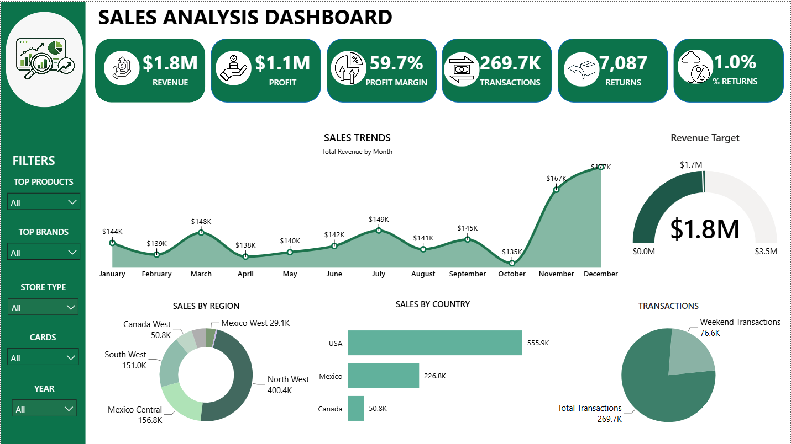

# 📊 Sales Analysis Dashboard

## Overview

The Sales Analysis Dashboard is an interactive Power BI solution designed to monitor and evaluate business performance through key sales metrics, revenue trends, transaction analysis, and regional performance tracking.

The dashboard provides decision-makers with a centralized reporting platform to analyze revenue growth, profitability, sales distribution, and operational performance through dynamic visualizations and KPI monitoring.

---

## Business Problem

Businesses generate large volumes of sales data across multiple regions, countries, products, and customer segments. Without a centralized reporting solution, identifying performance trends, monitoring key metrics, and making informed business decisions becomes challenging.

This dashboard was developed to transform raw sales data into meaningful business insights through interactive analytics and visual reporting.

---

## Project Objectives

* Monitor Revenue, Profit, Transactions, and Returns
* Analyze monthly sales trends and performance patterns
* Track revenue achievement against business targets
* Evaluate regional and country-level sales performance
* Identify high-performing business segments
* Support data-driven decision-making through KPI monitoring

---

## Dashboard Features

### Executive KPI Monitoring

* Total Revenue
* Total Profit
* Profit Margin %
* Total Transactions
* Total Returns
* Return Rate %

### Sales Trend Analysis

* Monthly Revenue Trends
* Growth Pattern Identification
* Performance Tracking Over Time

### Geographic Analysis

* Regional Sales Distribution
* Country-Level Performance Analysis

### Performance Monitoring

* Revenue Target Achievement
* Transaction Distribution Analysis
* Business Performance Insights

### Interactive Reporting

* Dynamic Filters
* Product Filtering
* Brand Filtering
* Store Type Filtering
* Year-Based Analysis

---

## Tools & Technologies

* Power BI
* Power Query
* DAX
* Data Modeling
* Data Visualization

---

## Project Workflow

```text
Raw Data
   ↓
Power Query
   ↓
Data Cleaning & Transformation
   ↓
Data Modeling
   ↓
DAX Measures
   ↓
Interactive Dashboard
   ↓
Business Insights
```

### Development Process

1. Imported and explored the sales dataset.
2. Performed data cleaning and transformation using Power Query.
3. Built relationships between tables using data modeling techniques.
4. Created DAX measures to calculate business KPIs.
5. Designed interactive visuals and filters.
6. Developed an executive-level dashboard for performance monitoring.
7. Generated actionable business insights through data analysis.


## Skills Demonstrated

### Power BI

* Dashboard Development
* KPI Design
* Interactive Reporting

### Data Modeling

* Relationship Management
* Analytical Data Structures

### DAX

* Business Calculations
* KPI Measures
* Performance Metrics

### Business Analytics

* Trend Analysis
* Performance Evaluation
* Geographic Analysis
* Decision Support Reporting

---

## Key Insights

* Total Revenue increased by 23.27% between January 1997 and December 1997.
* Revenue experienced strong growth beginning in August 1997, increasing by 25.70% within four months.
* North West region contributed 48.04% of total quantity sold.
* USA recorded the highest sales volume with 555,899 units sold.
* Revenue successfully exceeded the defined business target.
* Transaction activity remained strong while maintaining a low return rate.

---

## Business Impact

This dashboard enables stakeholders to monitor business performance efficiently, identify growth opportunities, evaluate regional sales contributions, and track critical KPIs through a centralized reporting solution.

The solution helps reduce manual reporting efforts while improving visibility into key business metrics.

---

## Dashboard Preview

### Sales Analysis Dashboard

()

---

## Conclusion

This project demonstrates the complete Power BI development lifecycle, including data preparation, modeling, DAX calculations, KPI design, and interactive dashboard development. The dashboard converts raw sales data into actionable business insights that support strategic decision-making.

